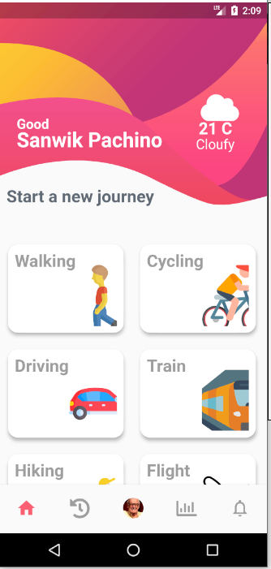

# ejemplo_social_app

Ejemplo de diseño de ventanas utilizando el custom painter para realizar figuras abstractas y animaciones de transcicion de ventanas. El diseño no es responsivo se visualiza de forma correcta en pantalla de 5.7"

## Diseño de ventanas

